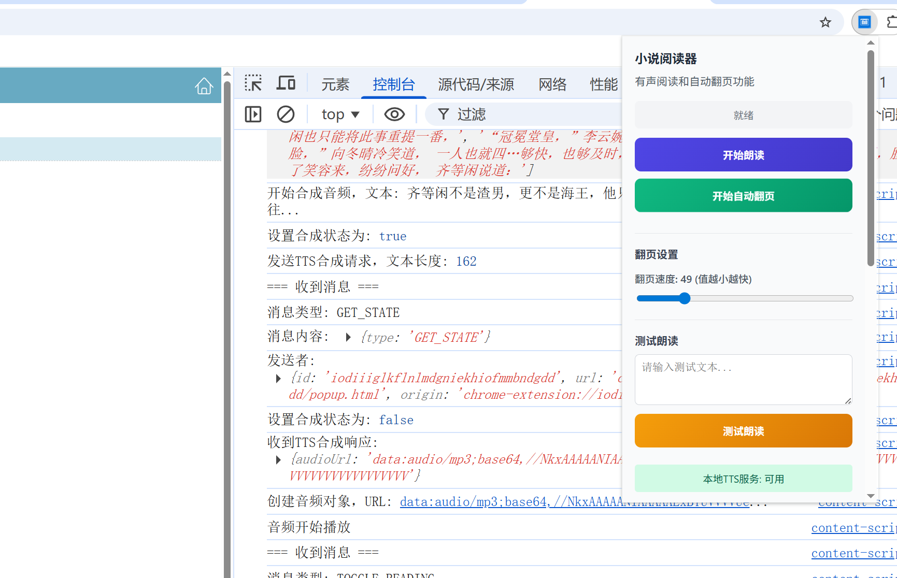
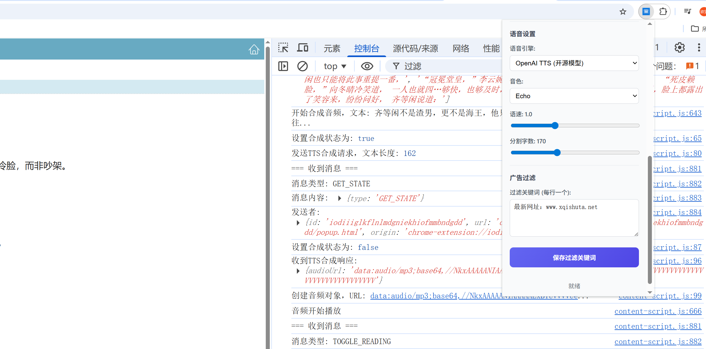

# 书虫有声阅读chrome插件

一个功能强大的浏览器扩展，为小说网站提供有声阅读和自动翻页功能。

## 功能特点

- 🎧 **有声阅读**：支持浏览器内置TTS和OpenAI TTS（开源模型）
- 📖 **自动翻页**：可调节翻页速度
- 🎯 **智能分段**：按标点符号智能分割文本，确保朗读流畅
- 🔍 **右键朗读**：选择文本后右键从当前位置开始朗读
- 🛠️ **广告过滤**：自定义关键词过滤广告内容
- 🌐 **跨网站兼容**：支持奇书网、笔趣阁等多个小说网站

## 界面预览

### 主界面



### 朗读设置



## 安装方法

### 方法一：从 Chrome 商店安装

（未来发布到 Chrome 商店后）

### 方法二：本地加载

1. **克隆代码**
   ```bash
   git clone https://github.com/zhangshenglizhufeng/bookwormAudioReadingChromeExtension.git
   cd bookwormAudioReadingChromeExtension
   ```

2. **打开 Chrome 扩展管理页面**
   - 输入 `chrome://extensions/` 到地址栏
   - 开启右上角的「开发者模式」

3. **加载扩展**
   - 点击「加载已解压的扩展程序」
   - 选择 `novel-reader-extension` 文件夹

## 使用指南

### 基本使用

1. **打开小说网站**（如奇书网、笔趣阁等）
2. **点击扩展图标**打开控制面板
3. **点击「开始朗读」**开始有声阅读
4. **点击「开始自动翻页」**启用自动翻页

### 右键朗读

1. **选择文本**：在小说页面选择一段文字
2. **右键点击**：选择「从这里开始阅读」
3. **开始朗读**：扩展会从选择的位置开始朗读

### 调整设置

- **语音引擎**：选择浏览器内置或OpenAI TTS
- **音色**：选择不同的语音（Alloy、Echo、Fable等）
- **语速**：调节朗读速度（0.5-2.0）
- **分割字数**：调整文本分段大小（100-300）
- **翻页速度**：调整自动翻页速度（值越小越快）
- **广告过滤**：添加自定义关键词过滤广告

## TTS 服务部署

扩展默认使用本地 TTS 服务，需要部署 OpenAI TTS 开源模型。

### 方法一：使用 Docker 部署（推荐）

1. **安装 Docker**：确保已安装 Docker 和 Docker Compose

2. **启动服务**：在扩展目录执行
   ```bash
   docker-compose up -d
   ```

3. **验证服务**：访问 `http://localhost:5050` 确认服务运行

### 方法二：手动部署

1. **安装 Python**：确保 Python 3.8+ 已安装

2. **安装依赖**
   ```bash
   pip install fastapi uvicorn httpx
   ```

3. **启动服务**：运行 TTS 服务脚本

### TTS 服务配置

- **服务地址**：`http://localhost:5050`
- **API 端点**：`/v1/audio/speech`
- **支持的引擎**：Microsoft Azure TTS
- **中文音色**：晓晓、晓伊、云希、云野、云霞、云阳、云健、云晓、小贝(辽宁)、晓妮(陕西)
- **语音风格**：聊天、平静、开心、悲伤、愤怒、恐惧、不满、严厉、撒娇、温柔
- **高级功能**：音调调整、语速调整、语言筛选、性别筛选

## 支持的网站

- ✅ 奇书网 (https://www.xqishuta.net)
- ✅ 笔趣阁 (https://www.bqg683.xyz, https://www.bqg104.cc)
- ✅ 其他大部分小说网站（自动适配）

## 常见问题

### Q: 为什么右键菜单没有「从这里开始阅读」选项？
A: 请确保：
- 已选择文本
- 扩展已正确加载
- 重新加载网页

### Q: TTS 服务连接失败怎么办？
A: 检查：
- Docker 服务是否运行
- TTS 服务端口是否为 5050
- 防火墙是否阻止了本地连接

### Q: 广告过滤不生效？
A: 请在设置中添加具体的广告关键词，每行一个。

## 技术架构

- **前端**：HTML5 + CSS3 + JavaScript
- **后端**：Python + FastAPI（TTS服务）
- **存储**：Chrome 存储 API
- **部署**：Docker Compose

## 开源协议

本项目采用 **Apache 2.0 许可证**，允许：

- ✅ 商业使用
- ✅ 修改代码
- ✅ 分发代码
- ✅ 私人使用

**注意**：Apache 2.0 许可证提供专利保护，适合商业项目使用。

## 贡献指南

1. **Fork 仓库**
2. **创建分支** (`git checkout -b feature/AmazingFeature`)
3. **提交修改** (`git commit -m 'Add some AmazingFeature'`)
4. **推送到分支** (`git push origin feature/AmazingFeature`)
5. **打开 Pull Request**

## 联系方式

- **开发者**：野生程序员
- **微信**：ailiaofun
- **邮箱**：1354164181@qq.com
- **GitHub**：https://github.com/zhangshenglizhufeng

---

**享受有声阅读的乐趣！** 📚🎧